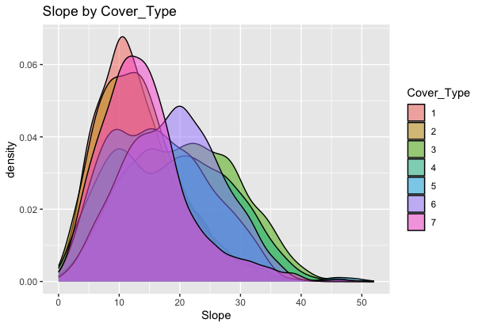

# Forest Cover Type - Classification

## 🛠️ Overview

This project tackles a multiclass classification problem using data from the Roosevelt National Forest in northern Colorado. The goal is to predict the **dominant type of tree cover** based on geographic and environmental features, using a stack of machine learning models in R.

Here is a link to my [kaggle notebook](https://www.kaggle.com/code/isaacaguilar27/forestcoveredtypeanalysis/notebook) for more reference



***

## 🧩 Project Pipeline

### 1. Tools & Processes

* `tidymodels` (recipes, workflows, parsnip, tune)
* `ranger`, `glmnet`, `lightgbm`, `bonsai` (model engines)
* `stacks` (for ensemble modeling)
* `vroom`, `DataExplorer`, `skimr` (EDA and IO)
* `doParallel` (for multicore cross-validation)

### 2. Load & Explore the Data (EDA)

* **Source**: Kaggle (for learning and practice)
* **Target**: `Cover_Type` — 7 tree categories (equal distribution: 2160 observations each)
* **Features**: 54 predictors including:
  * Continuous: Elevation, Slope, Hillshade (AM/Noon/PM), Horizontal/Vertical Distance to Hydrology
  * Categorical: Wilderness Areas (4 dummies), Soil Types (40 dummies)

```r
# Load the data
trainSet <- vroom('./train.csv')
testSet <- vroom('./test.csv')
trainSet$Cover_Type <- as.factor(trainSet$Cover_Type) # Convert Cover_Type as a factor

dplyr::glimpse(trainSet) # summary(trainSet) # skimr::skim(trainSet) # I
# have a few zero variable predictors
#
# # What is the Response Variable (Cover_Type with 7 categories)
unique(trainSet$Cover_Type)
#
# Count per type 
summary(trainSet$Cover_Type) # They all have the same amount
# 2160
#
# Look at distributions from 2 to 11 per category 
colnames(trainSet)[2:11]
#
ggplot(trainSet, aes(x = Elevation, fill = Cover_Type)) + geom_density(alpha =
0.5) + labs(title = "Elevation by Cover_Type") # Elevation is very different per type 
ggplot(trainSet, aes(x = Aspect, fill = Cover_Type)) +
geom_density(alpha = 0.5) + labs(title = "Aspect by Cover_Type") # Aspect is alittle different 
ggplot(trainSet, aes(x = Slope, fill = Cover_Type)) +
geom_density(alpha = 0.5) + labs(title = "Slope by Cover_Type") # Slope isalmost the same 
ggplot(trainSet, aes(x = Slope, fill = Cover_Type)) +
geom_density(alpha = 0.5) + labs(title = "Slope by Cover_Type")
```

<figure><figcaption></figcaption></figure>

### 3. Data Preprocessing & Feature Engineering

* Removed zero-variance predictors
* Normalized numeric features
* Converted `Cover_Type` to a factor for classification
* Created 5-fold cross-validation splits

Used the `tidymodels` framework along with `recipe()` steps to standardize and prepare data across all models consistently.

```r
# Recipe
my_recipe <- recipe(Cover_Type~., data=trainSet) %>% 
  step_rm('Id') %>%
  step_zv(all_predictors()) %>%# remove all zero variance predictors
  step_normalize(all_numeric_predictors())  # normalized all numeric predictors
# glm target encoding encoding predictors

## Split data for CV
folds <- vfold_cv(trainSet, v = 5, repeats=1)

## Control Settings for Stacking models
untunedModel <- control_stack_grid()
tunedModel <- control_stack_resamples()
```

***

### 4. Modeling Workflow

Each model was trained using the same preprocessing pipeline and cross-validation strategy.

#### Random Forest

* `mtry = 26`, `trees = 300`, `min_n = 2`
* Engine: `ranger`
* Metric: `roc_auc`
* Well-suited for high-dimensional feature spaces with dummies.

#### Boosted Trees (LightGBM)

* `tree_depth = 6`, `trees = 50`, `learn_rate = 0.1`
* Engine: `lightgbm`
* Quick and accurate, with less tuning effort required.

#### Penalized Logistic Regression

* Multinomial family with L2 regularization
* Engine: `glmnet`
* Efficient baseline model that provides interpretable coefficients.

```r
# RANDOM FOREST -----------------------------------------------------------

# Model
rf_mod <- rand_forest(mtry = 26,
                      min_n=2,
                      trees=300) %>% #Type of model
  set_engine("ranger") %>% # What R function to use
  set_mode("classification")

## Workflow
rf_wf <- workflow() %>%
  add_recipe(my_recipe) %>%
  add_model(rf_mod)

# Cross-validation 
rf_results <- rf_wf %>%
  fit_resamples(resamples = folds,
                metrics = metric_set(roc_auc),
                control=untunedModel)


# ## Set up grid of tuning values
# tuning_grid <- grid_regular(mtry(range = c(1,51)),
#                             levels = 5, 
#                             min_n()) # Maybe don't use levels
# 
# # Cross Validation
# rf_models <- rf_wf %>%
#   tune_grid(resamples=folds,
#             grid=tuning_grid,
#             metrics=metric_set(accuracy),
#             control=tunedModel)


# load("FCTrf.Rdata")
# save(rf_models, file = "FCTrf.Rdata")


# PENALIZED LOGISTIC REGRESSION -------------------------------------------

plg_mod <- multinom_reg(mixture=0, penalty=1) %>%
  set_engine("glmnet", family = "multinomial")

# Workflow
plg_wf <- workflow() %>%
  add_recipe(my_recipe) %>%
  add_model(plg_mod)

plg_results <- plg_wf %>%
  fit_resamples(resamples = folds,
                metrics = metric_set(roc_auc),
                control=untunedModel)

# ## Grid of values to tune over
# tuning_grid <- grid_regular(penalty(),
#                             mixture(),
#                             levels = 5) 
# 
# ## Run the CV
# plg_models <- plg_wf %>%
#   tune_grid(resamples=folds,
#           grid=tuning_grid,
#           metrics=metric_set(accuracy),
#           control=tunedModel)
# 
# 
# 
# load("FCTplg.Rdata")
# save(plg_models, file = "FCTplg.Rdata")


# BOOST TREES -------------------------------------------------------------

boost_model <- boost_tree(tree_depth=6,
                          trees=50,
                          learn_rate=0.1) %>%
  set_engine("lightgbm") %>% 
  set_mode("classification")

# Workflow
bt_wf <- workflow() %>%
  add_recipe(my_recipe) %>%
  add_model(boost_model)

bt_results <- bt_wf %>%
  fit_resamples(resamples = folds,
                metrics = metric_set(roc_auc),
                control=untunedModel)

# # Tune
# tuneGrid <- grid_regular(learn_rate(),
#                          levels = 3)
# 
# # Cross Validation
# bst_models <- bt_wf %>%
#   tune_grid(resamples=folds,
#             grid=tuneGrid,
#             metrics=metric_set(accuracy),
#             control = untunedModel)

# load("FCTbst.Rdata")
# save(bst_models, file = "FCTbst.Rdata")
```

***

### 5. Model Stacking

Using the `stacks` package, I created a stacked ensemble from the above three models:

```r
## Specify which models to include
forest_stack <- stacks() %>%
  add_candidates(rf_results) %>%
  add_candidates(bt_results) %>%
  add_candidates(plg_results)
  

# Fit the stacked model
fitted_forest_stack <-  forest_stack %>%
  blend_predictions() %>%
  fit_members()
```

&#x20;The final stacked model **outperformed individual models** by leveraging their strengths.

***

## 📈 Key Takeaways

* All models were evaluated using **cross-validation AUC**.
* The stacked model was used to predict the test set and export final predictions as `submissions.csv`.

```r
# Predict
forest_pred_stack <- fitted_forest_stack %>%
  predict(new_data = testSet)


# Format table
testSet$Cover_Type <- forest_pred_stack$.pred_class
results <- testSet %>%
  select(Id, Cover_Type)

# get csv file
vroom_write(results, 'submissions.csv', delim = ",")
```

***

## 🛤️ Future Improvements

* Tune the XGBoost model for better base performance
* Include penalized logistic regression in the final stack
* Try using SVM both independently and in the stack
* Experiment with feature selection or dimensionality reduction

***

This project demonstrated the power of combining multiple machine learning models to solve complex multiclass problems. The use of `stacks` enabled a robust and flexible ensemble approach that performed well with minimal tuning.&#x20;

I also gained valuable experience managing high-dimensional data and building reproducible modeling workflows in R.

Thanks for reading, and keep the learning going.
