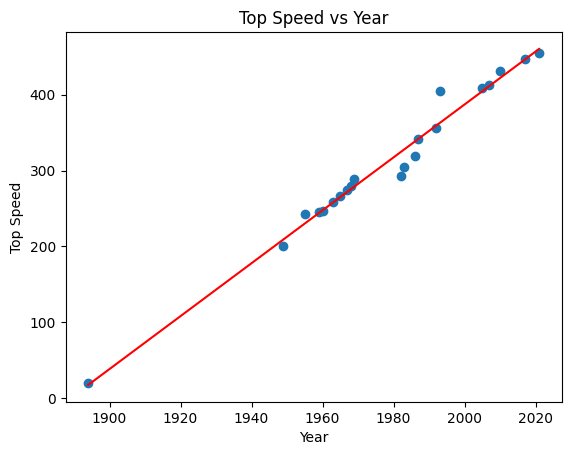

# Speed over Time - Simple Linear Regression

## 🛠️ Overview

This project explores how the top speeds of production cars have evolved over the years using publicly available data from Wikipedia. I scraped the data, cleaned it using `pandas`, visualized it with `matplotlib`, and built a simple linear regression model using `scikit-learn` to quantify the trend.

***

## 🔥 Problem Statement

* Understand "How has the top speed of the fastest production cars changed over time?" We’ll collect data, clean it, analyze the trend, and model the relationship between **Year** and **Top Speed**.

***

## 🧩 Project Pipeline

### 1. Import the packages

```python
import requests
import pandas as pd
from bs4 import BeautifulSoup
from sklearn.linear_model import LinearRegression
import seaborn as sns
import matplotlib.pyplot as plt
import numpy as np
```

* `requests` & `BeautifulSoup` for web scraping
* `pandas` & `numpy` for data manipulation
* `scikit-learn` for regression modeling
* `matplotlib` & `seaborn` for visualization

### 2. Collect the Data

I scraped a sortable Wikipedia table from this [page](https://en.wikipedia.org/wiki/Production_car_speed_record) using `BeautifulSoup`.

```python
### Get my Table from the web into txt

# Send a GET request to the Wikipedia page
url = "https://en.wikipedia.org/wiki/Production_car_speed_record"
response = requests.get(url)

# Parse the HTML content using BeautifulSoup
soup = BeautifulSoup(response.content, "html.parser")

# Find the table containing the Production speed car world records
table = soup.find("table", {"class": "wikitable sortable"})

# Extract the headers of the table
headers = [header.text.strip() for header in table.find_all("th")]

# Extract the rows of the table
rows = []
for row in table.find_all("tr")[1:]:
    row_data = [data.text.strip() for data in row.find_all("td")]
    rows.append(row_data)
    
### Turn my txt table into a pandas dataframe
df = pd.DataFrame(rows, columns=headers)
```

### 3. Data Cleaning

To focus on year and speed, I removed less relevant columns, cleaned up text fields, and converted strings to numeric types.

```python
df = df.drop(["Engine", "Comment"], axis=1)
# Split these strings in Top Speed column and extract the numeric value in KMPH (Before we hit a space).
s = df["Top speed"].str.split().str[0]
df["Top speed"] = [f"{float(x):.3f}" for x in s.tolist()]

# Show my first 5 rows of my table to see how it looks
df.head()
```

|   | Year | Make and model             | Top speed | Number built |
| - | ---- | -------------------------- | --------- | ------------ |
| 0 | 1894 | Benz Velo                  | 20.000    | 1,200        |
| 1 | 1949 | Jaguar XK120               | 200.500   | 12,061\[5]   |
| 2 | 1955 | Mercedes-Benz 300 SL       | 242.500   | 1,400        |
| 3 | 1959 | Aston Martin DB4 GT        | 245.400   | 75           |
| 4 | 1960 | Aston Martin DB4 GT Zagato | 247.000   | 19           |

### 4. Linear Regression Model

Using `scikit-learn`, I trained a linear regression model to estimate how much top speeds have increased per year.

```python
# Make Year and Top Speed numeric variables
df['Top speed'] = pd.to_numeric(df['Top speed'], errors='coerce')
df['Year'] = pd.to_numeric(df['Year'])

# Instantiate a LinearRegression model
model = LinearRegression()
x = df[["Year"]]
y = df["Top speed"]

# Fit the model using the Year and Top speed columns
my_model = model.fit(x, y)
```

```python
# Compute the slope and intercept of the regression line
slope = model.coef_[0]
intercept = model.intercept_

# Print the result as a formatted string
print(f"The equation for the line of best fit is: Y = [{slope}] (X) - {intercept*-1}")
```

**Equation of the regression line**:

$$
Top Speed = 3.49 × Year − 6829.84
$$

```python
R = my_model.score(x, y)
print(f"The coefficient of determination is:{R} Meaning {R*100} percent of the variation in Y can be attributed to X.")
```

**R² score**:

* **0.9797**, meaning \~98% of the variation in top speed can be explained by the year.

### 5. Visualization

I plotted the original data and the regression line to visualize the trend.

```python
plt.scatter(x, y)

# Predict y values using the model and the x values for plotting the regression line
y_pred = my_model.predict(x)

# Plot the fitted line
plt.plot(x, y_pred, color='red')

# Set the axis labels and title
plt.xlabel('Year')
plt.ylabel('Top Speed')
plt.title('Top Speed vs Year')

# Show the plot
plt.show()
```

<figure><figcaption></figcaption></figure>

## 📈 Key Takeaways

* The top speed of the world’s fastest production cars has increased significantly and steadily over time.
* The high R² score suggests that **time (Year)** is a strong predictor of **maximum production car speed**.
* This project showcases a full data pipeline: **web scraping → cleaning → modeling → visualization**.

***

This project was a valuable exercise in end-to-end data analysis—from scraping real-world data to modeling and visualizing meaningful trends. By analyzing how production car speeds have evolved over time, I not only gained deeper insight into the pace of automotive innovation but also reinforced key technical skills in data cleaning, linear regression, and visualization.&#x20;

Thanks for reading, and keep the learning going.
